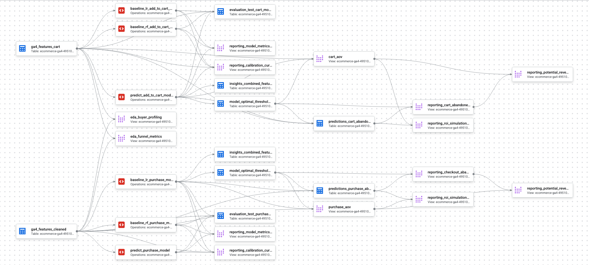
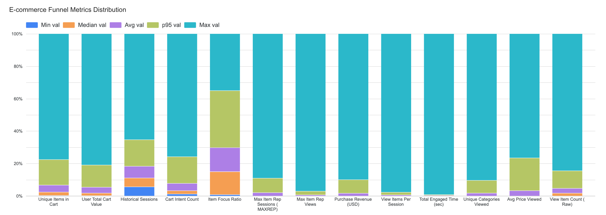
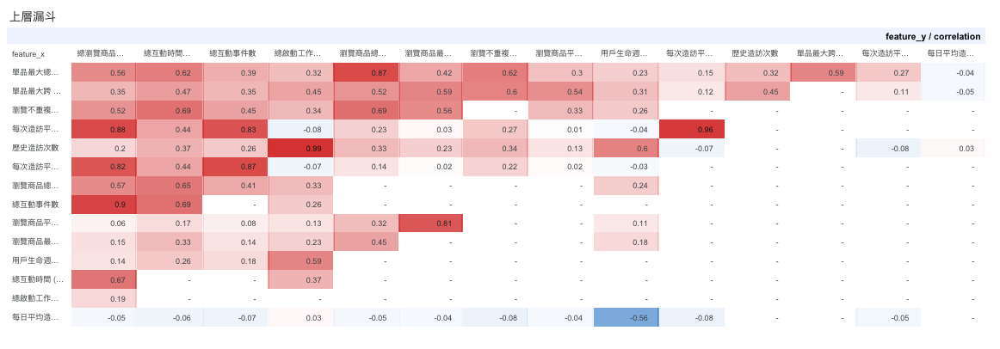
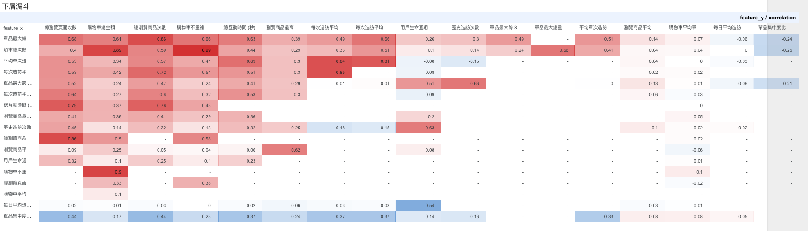
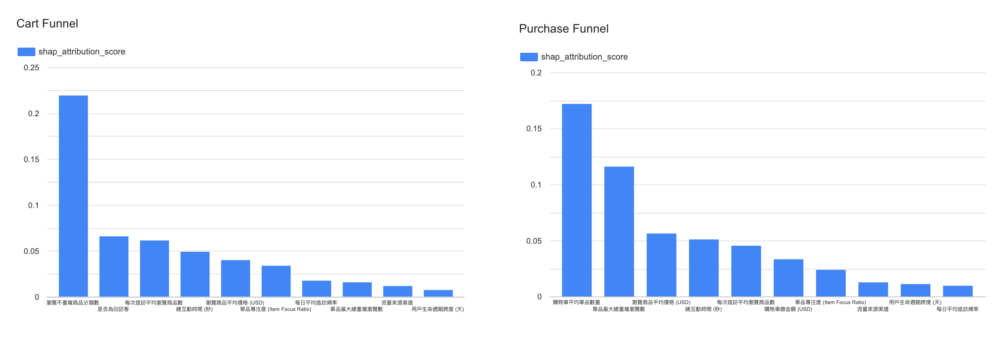
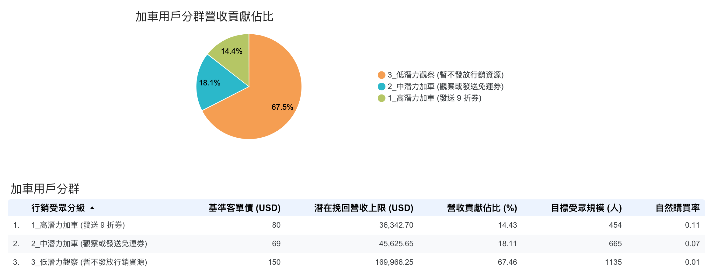
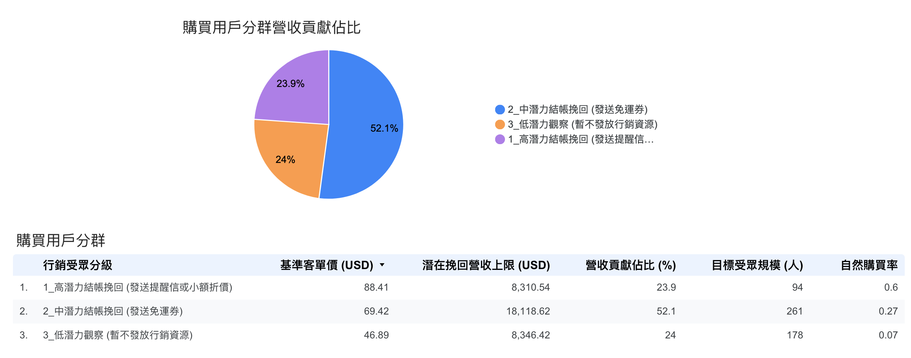

# 電商分眾決策模擬系統

> 以雙層漏斗機器學習架構與動態決策門檻，從 9 萬名電商訪客的瀏覽與購物車行為中識別加車與購買意圖，將流失用戶精準分層挽回——以數據驅動取代一刀切補貼陷阱。

**技術標籤：** `Google Analytics 4` · `BigQuery ML` · `Dataform` · `Python` · `Looker Studio` · `XGBoost` · `SHAP`

📄 完整報告：[電商分眾決策模擬系統.pdf](電商分眾決策模擬系統.pdf)

---

## 🎯 專案概述

### 背景與問題定義

傳統電商行銷在挽回流失用戶時，常對所有「購物車未結帳」的受眾一律發放優惠券。這種「一刀切」的盲目補貼忽視了消費者漏斗深度的差異：意圖模糊的低潛力族群往往消耗最多預算、卻產生極低的真實轉換，導致利潤被補貼浪費（Cannibalization）侵蝕。

本專案建構高精準度的雙漏斗轉換預測模型。有別於黑箱做法，結合四篇消費者心理學與機器學習理論文獻，建構端到端的 MLOps「雙漏斗階段（預測加車 ➔ 預測購買）」分層建模策略。以模型機率門檻（F1-max）為分群邊界，並將手法選擇與成本經濟拆成獨立的下游層（避免門檻與手法的循環依賴），把流失用戶分為三個受眾層，依各層特性（成交接近度、價值、規模）配對差異化的介入，避免對低意圖用戶無效補貼。

## 💡 核心商業洞察

**1. 雙漏斗驅動機制截然不同，由 EDA 與 SHAP 雙重驗證。**

EDA 顯示上層關鍵特徵在高低分層間差距達近 4–7 倍（瀏覽商品數 6.6×、跨類別 6.9×、單品重複 6.7×、停留時間 3.8×），遠大於下層的約 2–2.2 倍。SHAP 進一步確認質性差異：上層由「瀏覽分類廣度」單一主導（SHAP ≈ 0.22，為第二名約 3.4 倍），第二名為「是否回訪客」（≈ 0.065）；`item_focus_ratio` 降至第 6（0.033）。下層由「購物車平均單品數量」主導（SHAP ≈ 0.175），第二名為「MAXREP（單品最大重複瀏覽數）」（≈ 0.115）；總互動時間降至第 5（0.048），反映購買由「商品考量廣度 ＋ 單品反覆猶豫」雙引擎驅動。兩者預測結構差異是拆分建模的核心依據。

**2. 漏斗階段 × 成交摩擦決定最適介入工具，而非一律補貼高分族群。**

配置原則：介入強度 ∝ 需要克服的摩擦，且只投在夠有反應的層。

- **購買漏斗：** 高潛力（> 0.50）自然購買率已達 60%、最接近成交，只需零成本提醒信輕觸（對最可能自己回頭的人灑券 ＝ 補貼本來就會買的人）；中潛力（0.30–0.50）仍猶豫，改發免運券移除「運費痛點」這個結帳放棄主因。
- **加車漏斗：** 高潛力自然購買率 11%、中潛力 7%；把最強的價格槓桿（9 折券）集中於意圖最強的高潛力層（自然購買率 11%，最保守毛利假設下 uplift ＋5.5pp 即打平），中潛力採較輕的免運／觀察。
- **兩漏斗低潛力皆不投**（自然轉換極低，補貼 ROI 無法正當化）。

這個「依成交摩擦配對手法、把預算留給有反應的層」的設計，正是本專案區別於「高分即發券」一刀切的核心邏輯。

**3. 雙漏斗統一採用 XGBoost；Purchase 漏斗 RF 效能更強但以架構一致性入選。**

加車漏斗 XGBoost ROC-AUC（0.79）、Log Loss（0.47）均最佳，是明確選擇。購買漏斗 RF ROC-AUC（0.83）優於 XGBoost（0.78）達 0.05，RF 為真正效能最強者；選 XGBoost 純為統一 MLOps 管線，此為已知折衷，後續可改以 RF 部署下層。

## 📦 資料來源與分析範圍

- **資料集介紹：** 使用 Google BigQuery 公開資料集，原始資料來自 Google 自家電商平台（Google 周邊商品店）的真實用戶行為紀錄，由 Google 官方釋出供公眾研究使用，數值經過部分模糊化處理以保護用戶隱私。
- **資料格式與時間範圍：** Google Analytics 4（GA4）事件流，每筆紀錄代表一個用戶在網站上的一個動作（瀏覽頁面、查看商品、加入購物車、進入結帳、完成購買等）。資料涵蓋 2020 年 11 月至 2021 年 1 月，橫跨黑色星期五、聖誕節等電商旺季，共追蹤超過 85,000 名活躍用戶的完整購物路徑。
- **巢狀資料結構：** GA4 原始資料是巢狀的事件序列，特徵工程的第一步就是從原始事件中提取有意義的行為特徵（如跨 Session 的瀏覽廣度、單品重複檢視次數、購物車金額等），再送入模型訓練。
- **Scope 決策：** 初步 EDA 顯示美國單一市場佔整體流量約 43%，且貢獻絕大部分營收。本專案聚焦美國市場，在最大化商業代表性的同時，確保模型訓練資料的一致性，避免多市場混訓帶入不必要的特徵噪音。

## 🛠 技術架構與資料管線

本專案建立具備高自動化與防禦性的機器學習管線，將龐雜的 GA4 原始事件資料轉化為可落地的商業決策引擎：

- **資料清洗與特徵工程（Dataform / SQLX）：** 進行資料去噪，針對缺失值和極端值執行標準化，處理特徵共線性問題。
- **雙軌預測模型與可解釋性（BigQuery ML & SHAP）：** 針對不同漏斗階段部署不同 XGBoost 模型，並導入 SHAP 演算法解開黑盒子，量化促成轉換的關鍵特徵。
- **嚴格防漏機制（Data Leakage Prevention）：**
  - **時序資料切分（Time-Series Split）：** 將資料嚴格劃分為互不重疊的訓練集（2 個月）、驗證集（3 週）與獨立盲測集（10 天），確保所有商業效益預估皆來自未知的未來流量。
  - **截斷點機制（Time Cutoff）：** 以目標行為發生時間點作為「觀察終止線」，嚴格拋棄該點後的所有行為特徵（上層以 `MIN(add_to_cart)` 為界，下層以 `MIN(begin_checkout OR purchase)` 為界），確保預測邏輯符合真實世界的因果關係。

*Dataform DAG／資料管線架構流程圖*

## 🛒 基於消費者行為理論的特徵工程

### 核心策略：雙漏斗分層建模（Dual-Funnel Strategy）

- **策略：** 上漏斗預測「加入購物車」（全體活躍用戶），下漏斗預測「最終購買」（僅限已加車用戶）。
- **理論支持：** 根據 Kukar-Kinney & Close (2010)，消費者加入購物車常出於「比價」或作為「願望清單（組織工具）」，並非完全等同於購買意圖。分層過濾能有效排除純比價或組織性質的雜訊，聚焦具備真實轉換潛力的用戶。

為精準捕捉用戶意圖並確保泛化能力，特徵工程嚴格執行防範資料洩漏（Data Leakage）與處理共線性（Collinearity）的雙漏斗特徵篩選機制。特徵矩陣涵蓋四大維度：

**📌 歷史價值與基礎活躍度**（`log_historical_session_count`, `days_in_dataset`, `session_frequency_per_day`, `is_returning_user`）
參考 Wu 等人 (2021) 的 Improved RFM 模型概念，將傳統絕對數值轉化為「觀察期活躍天數」與「每日平均造訪頻率」。上下漏斗皆納入此維度作為基礎轉換機率基準；將絕對次數轉為比例（Ratio）大幅提升對未來數據的泛化能力。

**📌 瀏覽脈絡與意圖收斂**（`log_unique_categories_viewed`, `log_total_value_viewed`）
Moe (2003) 指出，廣泛瀏覽多個分類通常屬於早期「探索型」買家，而高意圖買家會展現極低的分類瀏覽廣度。上漏斗保留分類數與總價值以捕捉探索廣度；下漏斗（已加車）果斷剔除此特徵，防止與高純度購物車特徵產生共線性、稀釋權重。

**📌 購物車明細與價格摩擦力**（`log_user_total_cart_value`, `log_unique_items_in_cart`, `log_cart_count`, `log_avg_price_viewed`）
Kukar-Kinney & Close (2010) 證實，結帳前對「訂單總成本」的擔憂與「等待降價」心理是購物車放棄的核心摩擦力。嚴格遵守時間截斷點，上漏斗排除 `log_cart_count` 等特徵以防資料洩漏；下漏斗將購物車含金量作為必備強訊號，並透過 LR 模型的 L2 正規化（Ridge）吸收高度共線性。

**📌 深度互動與單品猶豫度**（`log_max_item_rep_sessions`, `log_max_item_rep_views`（MAXREP）, `log_page_view_count`, `pages_per_session`）
結合 Sakar 等人 (2018) 的網頁互動深度指標，以及 Moe (2003) 的 MAXREP。MAXREP 捕捉用戶反覆查看單一商品的猶豫行為，在上漏斗極度稀疏（1.52%），但在下漏斗成為強勢特徵（21.3%）。上漏斗透過 `pages_per_session` 防禦 `page_view` 絕對值的共線性；下漏斗因意圖收斂放回絕對值以提供額外行為訊號。

> **資料分布特性：** 大部分數值特徵呈現極端右偏分布，因此在模型訓練前對所有數值特徵進行 Log 轉換。

*各漏斗特徵於高／低分層間的分布差異（Funnel Metric Distribution）*

### 用戶行為深度剖析（EDA）

在 EDA 階段，發現用戶行為特徵隨漏斗推進，呈現顯著的「意圖斷層」——驅動加車的信號與驅動購買的信號，本質上屬於兩種不同的行為維度：

**上層漏斗（未加車 ➔ 加車）：「探索廣度」的初步爆發**
跨類別瀏覽擴張 8.4 倍（0.27 ➔ 2.27 個品類）；每次造訪瀏覽商品數成長 16 倍（0.39 ➔ 6.27 項）；單品重複瀏覽次數增加 8.8 倍（0.39 ➔ 3.43 次）；總停留時間增加 5.7 倍（55.19 ➔ 311.76 秒）。值得注意的是，加車者的每日造訪頻率反而較低（1.19 ➔ 0.92）——意圖不是靠「更頻繁回訪」堆出來，而是靠單次造訪內更深的探索。

**下層漏斗（加車棄單 ➔ 最終購買）：「承諾深度」與購物車經濟規模的擴張**
最終購買者的每次造訪瀏覽商品數增加 2.3 倍（4.72 ➔ 10.78 項）；購物車不重複商品數擴張 2.2 倍（38.41 ➔ 83.55 項）；購物車總金額擴張 2.3 倍（$1,022.23 ➔ $2,307.47 USD）；總停留時間增加 2.1 倍（456.26 ➔ 951.72 秒）。購買者的每日造訪頻率同樣低於棄單者（0.93 vs 1.1）——他們用更少、更集中的 session 完成決策。

> **💡 一個跨漏斗的反直覺信號：承諾深度 ≠ 造訪頻率**
> 兩個漏斗都呈現同一模式：轉換者的每日造訪頻率反而低於未轉換者（加車 0.92 vs 未加車 1.19；購買 0.93 vs 棄單 1.1）。頻繁回訪不代表高意圖——反覆回訪卻不出手更像猶豫或比價；真正會轉換的人，是在單次造訪內投入更深（更高停留時間、更廣探索、更大購物車）。

### 💡 漏斗拆分決策

**拆分的實證前提：加車離購買並不近。** 有 `add_to_cart` 事件的 5,603 名用戶中，最終購買僅 1,304 人——加車 ➔ 購買轉換率 23.3%（以原始 cohort 統計），即 77% 的加車者棄車，與業界長期約七成的棄車率一致（建模 cohort 採擴充加車定義後為 24.1%）。加車不是購買的前廳，而是另一道獨立的決策關卡。

**EDA 進一步驗證：上下漏斗的驅動力截然不同。** 以合成的「單品專注度（Item Focus Ratio）」為例，在上層漏斗，專注度從 0.75 提升至 1.0，是確立加車意圖的強信號；但下層漏斗方向相反——最終購買者僅 0.70，棄單者反而 0.92，因為意圖已轉化為行動，注意力從單品轉移至結帳流程、運費計算與加購。相同特徵在不同階段預測方向完全相反，單一模型會互相抵銷權重——雙漏斗架構正是為了解決這個行為斷層。

另一個常見質疑：為什麼不直接做單一購買預測模型、把加車行為當特徵？因為上層模型服務對象是尚未加車的用戶——在 118,000+ 名活躍用戶中，經加車完成購買者僅 1,304 人（約 1.1%），對未加車母群而言購買是極稀有事件，單一模型幾乎沒有正類可學。兩階段拆解讓每個模型都有可學習的 base rate（加車 ～23%、加車後購買 ～24%），且每個輸出各自對接一個明確的營運決策。

### 特徵動態調整與共線性處理

對上下層漏斗的訓練集（TRAIN + VALIDATION）分別執行 Pearson 相關係數矩陣分析。

**📊 上層漏斗（預測加車）：探索與發散（Window Shopping）**
針對相關係數 > 0.80 的高共線性群組，採「保留商業解釋力最強者，剃除絕對冗餘」：

- 基礎流量計數：✅ 保留 `historical_session_count`；❌ 剃除 `count_session_start`（相關性 0.99）
- 瀏覽活躍度：✅ 保留 `view_item_count`、`view_items_per_session`；❌ 剃除 `count_engagement`（0.90）、`pages_per_session`（0.96）
- 價格與價值：✅ 保留 `avg_price_viewed`；❌ 剃除 `max_price_viewed`（0.81）、`total_value_viewed`（0.87 數學乘數共線性）

*上層漏斗（預測加車）特徵共線性診斷熱力圖*

**📊 下層漏斗（預測購買）：意圖收斂（Intent Convergence）**
針對相關係數 > 0.85 的重災區，採「保留代表性特徵，剃除絕對冗餘」：

- 購物車維度（0.89–0.99）：✅ 保留 `user_avg_items_per_cart`、`user_total_cart_value`；❌ 剃除 `cart_count`、`unique_items_in_cart`
- 活動量（0.79–0.86）：✅ 保留 `total_engaged_time_seconds`；❌ 剃除 `view_item_count`、`page_view_count`
- 單次造訪強度（0.84–0.85）：✅ 保留 `view_items_per_session`；❌ 剃除 `pages_per_session`、`avg_session_engaged_time_seconds`

*下層漏斗（預測購買）特徵共線性診斷熱力圖*

**🧬 新增衍生特徵：單品專注度（Item Focus Ratio）**
公式 `max_item_rep_views / view_item_count`。數值越接近 1，代表用戶越專注於單一商品（極高購買意圖）；數值越低代表仍在多個商品間猶豫。此比例轉換能有效消除絕對值帶來的共線性干擾，並維持雙漏斗模型的特徵一致性。

> 📄 完整特徵工程 SQLX（BigQuery / Dataform）：[`code/feature_engineering_cart.sql`](code/feature_engineering_cart.sql)

## 🤖 模型建構與評估

所有基準數據皆來自嚴格隔離的時序測試集（Test Holdout），以確保評估指標的絕對客觀性。

**時序資料切分策略（Time-Series Data Split）**

- **訓練集（Train）｜2020-11-01 至 2020-12-31（2 個月）：** 模型學習的基礎營地，吸收「瀏覽、加車到購買」的深層意圖與非線性規律。
- **驗證集（Validation）｜2021-01-01 至 2021-01-21（3 週）：** 超參數調優與尋找最佳 F1-Score 決策門檻，防止過度擬合。
- **獨立盲測集（Test Holdout）｜2021-01-22 至 2021-01-31（最後 10 天）：** 在訓練、調參、尋找門檻的整個過程中被完全實體隔離，最終評估矩陣（AUC、F1）皆產出自這組未知資料。

### 第一階段：購物車模型（Cart Models）

目標：在純瀏覽階段，預測使用者是否會將商品加入購物車。

| 模型演算法 | Accuracy | F1 Score | Log Loss | Precision | Recall | ROC AUC |
| --- | --- | --- | --- | --- | --- | --- |
| **XGBoost** | 0.76 | 0.21 | **0.47** | 0.62 | 0.12 | **0.79** |
| Logistic Regression | 0.70 | 0.51 | 0.53 | 0.44 | 0.62 | 0.77 |
| Random Forest | 0.70 | 0.51 | 0.53 | 0.43 | 0.60 | 0.77 |

**數據洞察：** 三模型 ROC-AUC 差距僅 0.02（XGBoost 0.79 最高）。以 ROC-AUC 為比較主軸（F1/Recall 受 0.5 固定門檻壓低）：XGBoost 在 `AUTO_CLASS_WEIGHTS=FALSE` 下輸出校準機率，~20% base rate 下多數預測落在 0.5 以下，最優門檻下 recall 正常；LR 與 RF 因推高正類預測而 Recall／F1 較高。上層消費者行為充滿雜訊（隨意點擊、跨站比價），XGBoost 的梯度提升能在高維、雜訊大的特徵空間有效捕捉非線性訊號。

### 第二階段：購買模型（Purchase Models）

目標：在加入購物車後、結帳前，預測使用者最終是否會完成購買。

| 模型演算法 | Accuracy | F1 Score | Log Loss | Precision | Recall | ROC AUC |
| --- | --- | --- | --- | --- | --- | --- |
| **Random Forest** | 0.74 | **0.66** | **0.50** | 0.57 | **0.77** | **0.83** |
| XGBoost | 0.74 | 0.58 | 0.56 | **0.61** | 0.55 | 0.78 |
| Logistic Regression | 0.70 | 0.28 | 0.58 | 0.60 | 0.18 | 0.69 |

**數據洞察：** RF ROC-AUC（0.83）明顯優於 XGBoost（0.78），差距擴大至 +0.05，RF 為真正效能最強者（高 Recall 源於 3× oversampling）；XGBoost val→test 降幅（0.83→0.78）略高於 RF（0.86→0.83），顯示 HPO 對較小的 purchase dataset 略有偏合。加車後的購買決策本質是多因素、帶交互的結構，適合 XGBoost 的非線性與交互捕捉能力。

**最終 MLOps 部署決策：** 兩漏斗均部署 XGBoost，選型以 ROC-AUC 為主要依據。上層效能明確支持 XGBoost；下層 RF 效能更強（+0.05），但為 MLOps 架構一致性（簡化 Dataform 管線維護）統一採 XGBoost，此為**已知效能折衷**，後續可考慮下層改用 RF 追回 0.05 ROC-AUC。類別不平衡處理：XGBoost 與 LR purchase 採 `AUTO_CLASS_WEIGHTS=FALSE` 輸出校準機率（機率具商業語意）；LR cart 採 TRUE；RF 兩漏斗皆採 oversampling。

> 📄 完整 XGBoost 加車模型訓練 SQLX：[`code/train_cart_model.sql`](code/train_cart_model.sql)

### 模型可解釋性分析（SHAP Feature Attribution）

*上層（加車）與下層（購買）漏斗的 SHAP 特徵重要度*

**上層漏斗：探索廣度決定加車意圖。** 最主要特徵是「瀏覽不重複商品分類數」，是第二名約 3.4 倍；第二名為「是否回訪客」。其後特徵皆 ≤ ~0.05。
→ 商業行動：強化跨分類推薦以延伸探索路徑（「搭配這個的人也買了……」）；鎖定回訪用戶做精準觸達（push 通知／再行銷／「最近瀏覽」功能）。

**下層漏斗：商品考量深度主導。** 最主要特徵是「購物車平均單品數量」；第二名為 MAXREP（反覆盯著特定商品的猶豫是強力購買訊號），其後為購物車總金額、每次造訪平均瀏覽商品數、總互動時間。
→ 商業行動：以「高互動時間 ＋ 高購物車金額」作為觸發條件，精準度高於廣撒。

## 💰 動態決策門檻與分眾挽回策略

不採固定 0.5 閾值，改以 SQL 自動計算最大化 F1-Score 的動態決策門檻，將流失用戶劃為高／中／低三層。介入手法有顯性成本階梯：提醒信 $0 ＜ 免運券 約 $6 ＜ 9 折券 約 $8。各層以「潛在挽回營收上限（人數 × AOV）」估算機會規模——此為 100% 轉換的**上界**，真實可挽回額需以 A/B 測 uplift 後確認。

### 加車漏斗（Cart Funnel）

門檻：高潛力 > 0.35、中潛力 0.21–0.35、低潛力 < 0.21。流失總數 2,254。

*加車漏斗：各分層營收貢獻佔比與分眾挽回策略*

| 分層 | 分數 | 人數（佔比） | 自然購買率 | 客單價 | 潛在挽回上限（貢獻） | 手法 |
| --- | --- | --- | --- | --- | --- | --- |
| 高潛力 | > 0.35 | 454（20.1%） | 11% | $80 | $36,342.70（14.43%） | **9 折券** |
| 中潛力 | 0.21–0.35 | 665（29.5%） | 7% | $69 | $45,625.65（18.11%） | 免運券／觀察 |
| 低潛力 | < 0.21 | 1,135（50.4%） | 1% | $150 | $169,966.25（67.46%） | 不投 |

**高潛力補貼經濟（為何對自然率 11% 用最強誘因）：** 每人期望補貼成本 ≈ 11% × $8 ≈ $0.88。設毛利率 m、折扣深度 d＝10%，打平所需 uplift ＝ 11% × d ÷（m − d）：

| 毛利率 m | 打平所需 uplift | 目標購買率 |
| --- | --- | --- |
| 30% | ＋5.5pp | 16.5% |
| 40% | ＋3.67pp | 14.67% |
| 50% | ＋2.75pp | 13.75% |

即使取最保守的 30% 毛利，購買率從 11% 拉到 16.5% 即打平；公式同時給出折扣深度上界（d 必須 < m）。**低潛力貢獻 67.46% 是「人數最多 × 客單價最高（$150）」撐起的上限假象——自然購買率僅 1%，判斷依據是「購買意願」非「消費能力」。**

### 結帳漏斗（Purchase Funnel）

門檻：高潛力 > 0.50、中潛力 0.30–0.50、低潛力 < 0.30。流失總數 533。

*結帳漏斗：各分層收益佔比與分眾挽回策略*

| 分層 | 分數 | 人數（佔比） | 自然購買率 | 客單價 | 潛在挽回上限（貢獻） | 手法 |
| --- | --- | --- | --- | --- | --- | --- |
| 高潛力 | > 0.50 | 94（17.6%） | 60% | $88.41 | $8,310.54（23.9%） | **提醒信** |
| 中潛力 | 0.30–0.50 | 261（49%） | 27% | $69.42 | $18,118.62（52.1%） | **免運券** |
| 低潛力 | < 0.30 | 178（33.4%） | 7% | $46.89 | $8,346.42（24%） | 不投 |

**反直覺重點：** 高潛力（自然率 60%）最接近成交，一封「購物車商品還在等您」提醒信很可能就足夠，不需在最可能自己回頭的人身上灑券。中潛力雖是「較輕」的免運手法，但自然購買率高達 24%（實際列表值 27%），白拿補貼的漏損反而最大——每人期望補貼 ≈ 27% × $6 ≈ $1.62，約為加車 9 折層（$0.88）的 1.84 倍：

| 毛利率 m | 打平所需 uplift | 目標購買率 |
| --- | --- | --- |
| 30% | ＋10.93pp | 37.93% |
| 40% | ＋7.44pp | 34.44% |
| 50% | ＋5.65pp | 32.65% |

同一組公式反向解釋了高潛力層為何只發信不發券：自然率越高，同一張券的漏損越貴。

### 後續驗證：分層 A/B Holdout（Incrementality Test）

以上手法配置是基於分群特性的假設；真正的增量效果（uplift）只有實驗能定：

1. 在每個有投放的分層內部隨機切兩組：treatment（發指派手法）vs control（完全不接觸）。
2. control 組轉換率 ＝ 該層真實的「不介入」基線（取代「整段購買率」代理）。
3. treatment − control ＝ 該手法在該層的 uplift。
4. 要比手法，就在同一層開多批次（例：加車高潛力同跑 9 折、免運、control）。
5. 優先序：先測「價值高 ＋ 最不確定」的格——購買中潛力（免運是否值得）、加車高／中潛力（9 折 vs 免運 vs 觀察），並在加車高潛力內加測折扣深度階梯（95 折 vs 9 折）。
6. 前置：做 power calculation，各層樣本小，不足就跨期累積。

## ⚠️ 限制與未來展望

**專案限制：**

- **季節性偏差（Seasonality Bias）：** 資料集中在 2020-11 至 2021-01（約三個月），涵蓋黑五、聖誕等高轉換節點，套用於淡季時機率與門檻可能需重新校準。購買漏斗 XGBoost Validation AUC（0.83）高於 Test（0.78），部分源於 HPO 以 validation AUC 為最佳化目標而偏樂觀——test 0.78 才是無偏估計。
- **機會規模為上界；自然率與手法配置皆為待驗證代理／假設：** 潛在挽回營收以「人數 × 分層 AOV」呈現為上限，不以淨利作為對外決策數字（淨利完全取決於無法觀察的假設 uplift）。報表「自然購買率」是整段購買傾向，作為優先級／校準訊號，而非被鎖定棄單者的真實 do-nothing 率。
- **門檻中潛力下界為啟發式；手法配置為特性導向假設：** 決策門檻採 F1-max，中潛力下界沿用門檻 × 0.6 的啟發式；「哪一層發哪種券」基於分群特性而非實測最優，且毛利率（40% ± 10pp）與免運成本（$6）均為外部假設參數。

**未來展望：**

- **演進至真實的提升模型（Uplift Modeling）：** 透過分層 A/B holdout 收集對照組與實驗組資料，讓模型直接學習因果效應，精準找出「只有拿到誘因才會購買」的勸誘客（Persuadables）。
- **即時串流預測（Real-time In-session Prediction）：** 導入串流處理（Kafka／Spark Streaming），在用戶仍在瀏覽的當下即時運算互動特徵，偵測意圖衰退即時觸發限時優惠，達成「當下攔截」而非事後補救。
- **個人化誘因最佳化（Personalized Incentive Allocation）：** 依用戶毛利貢獻度與介入成本動態決定誘因類型，搭配定期再訓練確保門檻同步以新分數重新校準。

## 📚 Reference

- Kukar-Kinney, M., & Close, A. G. (2010). The determinants of consumers' online shopping cart abandonment. *Journal of the Academy of Marketing Science*, 38(2), 240–250.
- Moe, W. W. (2003). Buying, Searching, or Browsing: Differentiating Between Online Shoppers Using In-Store Navigational Clickstream. *Journal of Consumer Psychology*, 13(1&2), 29–39.
- Sakar, C. O., Polat, S. O., Katircioglu, M., & Kastro, Y. (2018). Real-time prediction of online shoppers' purchasing intention using multilayer perceptron and LSTM recurrent neural networks. *Neural Computing and Applications.* https://doi.org/10.1007/s00521-018-3523-0
- Wu, J., Shi, L., Yang, L., Niu, X., Li, Y., Cui, X., Tsai, S.-B., & Zhang, Y. (2021). User Value Identification Based on Improved RFM Model and K-Means++ Algorithm for Complex Data Analysis. *Wireless Communications and Mobile Computing*, 2021. https://doi.org/10.1155/2021/9982484
