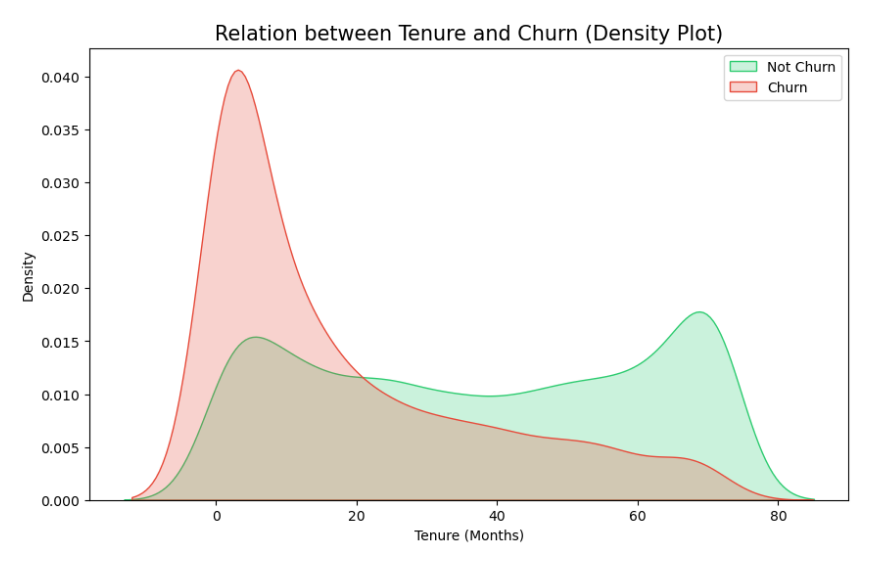
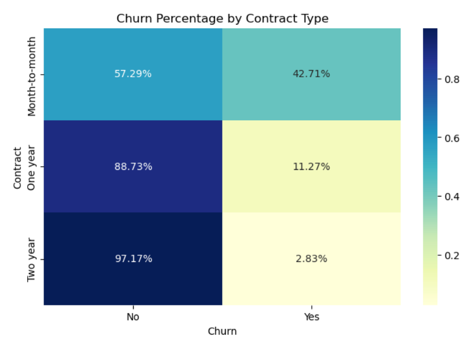
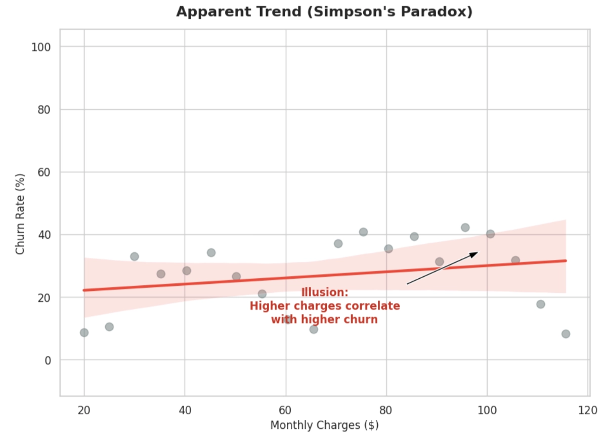
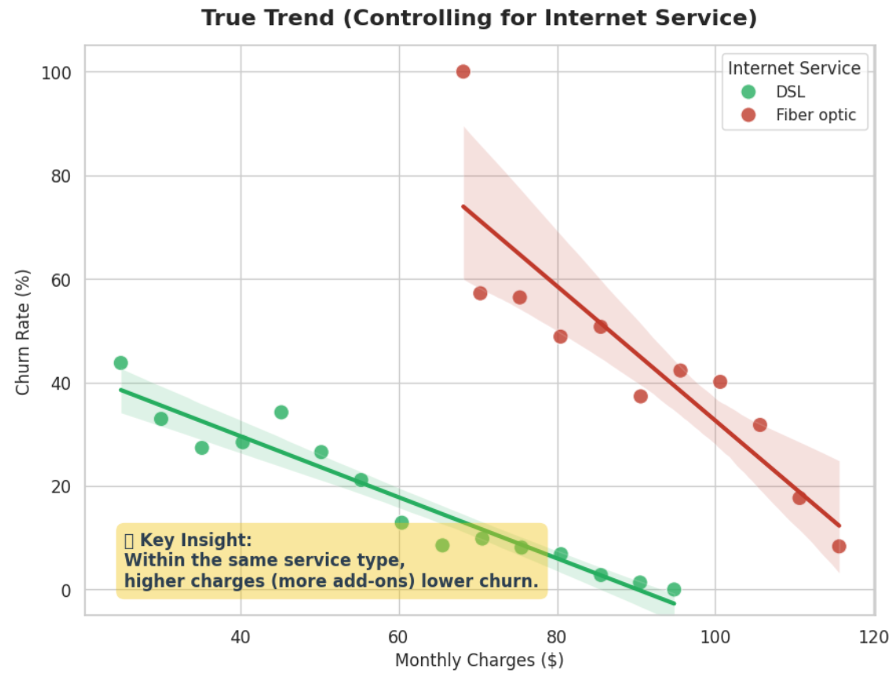
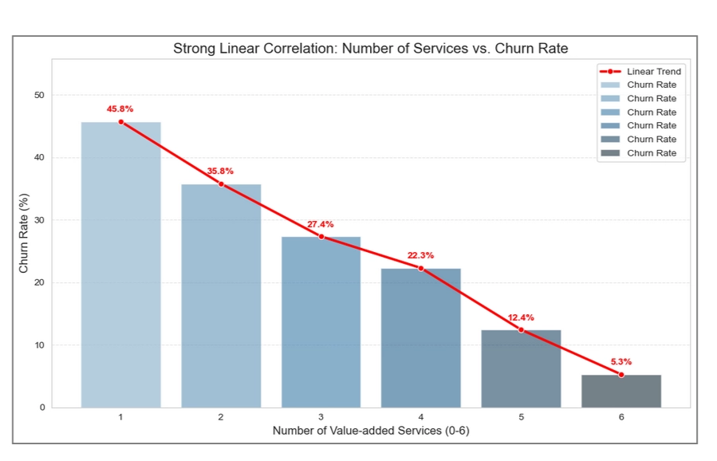
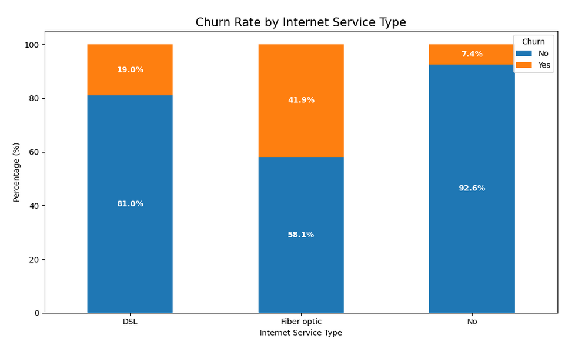
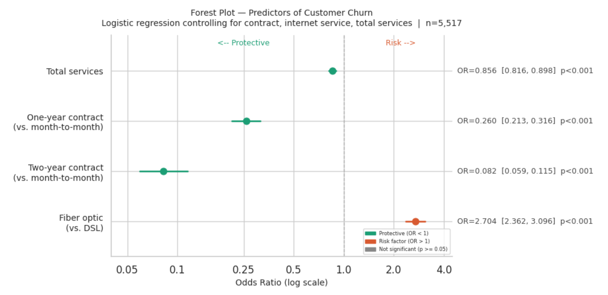

# 電信用戶流失分析與留存策略

> 找出關鍵流失因子，打造高價值客戶留存策略。

**技術標籤：** `Python` · `EDA` · `Logistic Regression` · `商業分析` · `客戶流失（Churn）`

📄 完整報告：[電信用戶流失分析與留存策略.pdf](電信用戶流失分析與留存策略.pdf)

---

## 🎯 專案概述

- **專案目標：** 解決電信業者獲客成本高昂的問題，透過分析客戶特徵，揪出高流失風險客群。
- **關鍵發現：**
  1. **光纖用戶的隱憂：** 在控制合約與月費變數下，光纖用戶的流失風險（Odds）高達 DSL 用戶的 2.25 倍（模型最終估計 OR＝2.704，見洞察三）。
  2. **加值服務的防禦力：** 每多訂閱一項加值服務，流失勝率獨立下降 14.4%。
  3. **合約與留存死亡谷：** 高達 42.7% 的「月繳型」用戶容易流失，且多發生在訂閱的 0–18 個月內。
- **策略建議：** 推動「綁約 ＋ 加值服務」同捆包，並針對光纖服務品質進行專案健檢。

## 📦 資料來源與分析範圍

- **資料集介紹：** 使用 Kaggle 公開資料集，原始資料來自 IBM 釋出的電信公司模擬客戶資料，是學術界與業界廣泛採用的流失預測基準資料集。
- **資料格式：** 約 7,000 名電信用戶的完整客戶檔案，每筆紀錄代表一位客戶在某時間點的快照，涵蓋用戶基本屬性（年齡層、是否有家庭成員）、服務訂閱組合（電話、網路、串流、技術支援等）、帳戶資訊（合約類型、月費、累計消費、使用年資），以及最終的流失標籤。
- **資料結構：** 為整理好的結構化表格，特徵工程重點在於識別混淆變數（Confounder）並控制用戶異質性，確保模型學到的是真正驅動流失的行為信號，而非服務組合差異造成的選擇偏誤。

## 📖 文獻回顧與商業邏輯定錨

為避免盲目將數據丟入黑盒子，針對電信產業特性進行學術文獻回顧，萃取影響流失的核心關鍵作為特徵工程基底：

- **產業核心痛點：** 電信業屬「合約型態」產業，用戶留存時間越長，流失率越低。
- **轉換成本效應：** 提高用戶的轉換成本是降低流失率的最有效解法，主要體現在「合約類型」與依賴的「加值服務」上。

| 理論維度 | 商業洞察與文獻支持 | 模型對應特徵 |
| --- | --- | --- |
| 行為特徵 | 電信業具合約特性，用戶黏著度隨時間遞增 | 留存時間 |
| 轉換成本 | 合約綁定與額外服務依賴，能有效墊高退租門檻 | 合約型態、加值服務 |
| 服務品質 | 基礎網路體驗是決定用戶去留的硬指標 | 網路類型 |
| 價格敏感度 | 每月固定支出高低直接影響性價比感知 | 月費 |

## 📊 數據洞察與視覺化

### 🔍 洞察一：合約類型與客戶生命週期的關鍵交叉

結合 EDA 與 T-檢定驗證，發現客戶流失具有極強的「時效性」與「合約依賴性」：

  
  

*左：Tenure 與流失的密度圖；右：各合約類型的流失比例*

- **流失高峰集中：** 密度圖顯示，流失極度集中於入網的 0–18 個月內。
- **懸殊的流失對比：** 「月繳型」用戶流失率高達 42.7%，是「兩年期合約（2.8%）」的 15 倍以上。
- **T-檢定佐證：** 流失者平均 Tenure 17.98 個月、留存者 37.57 個月（T＝−31.5796，p＝7.9991e-205），差異極顯著。

這揭示了電信留存的「死亡谷」：在缺乏長期合約約束（轉換成本低）下，新用戶入網初期忠誠度極脆弱。這關鍵的 18 個月，是決定客戶能否轉化為高 LTV 資產的黃金期。

### 🔍 洞察二：打破迷思！月費越高，流失率反而越低？（辛普森悖論）

  
  
  

*左：表面趨勢（Simpson's Paradox）；中：控制網路類型後的真實趨勢；右：加值服務數量與流失率的線性關係*

表面數據看似月費越高流失率越高，但這是受「光纖用戶高流失率」干擾產生的假象。在控制網路類型與合約條件後，月費越高（代表訂閱越多加值服務），流失率反而越低。

- **加值服務是獨立的留客護城河。** 各服務數量組的平均流失率呈單調下降，從訂閱 1 項的 45.8% 降至 6 項的 5.3%（EDA 階段斜率 −0.079，R²＝0.994）。羅吉斯迴歸中 `TotalServices` OR＝0.856（95% CI [0.816, 0.898]，p<0.001），證明每多一項加值服務，客戶流失勝率獨立下降 14.4%。
- **破除「高月費」的辛普森悖論。** 初步分析發現月費與加值服務存在嚴重多重共線性（VIF > 20），為確保模型係數不失真，最終模型主動排除月費特徵。這證實真正驅動「高月費、低流失」現象的，從來不是月費高低，而是背後的「服務綁定數量」。

### 🔍 洞察三：高風險的「高價值」客群——光纖用戶

  
  

*左：各網路服務類型的流失率；右：客戶流失預測因子的勝算比森林圖（Forest Plot）*

光纖網路（Fiber optic）客戶流失率高達 41.9%，遠高於無網路客戶（7.4%），甚至比傳統 DSL 用戶（19%）高出兩倍以上。同時控制合約類型與加值服務：

- **合約類型是最強的留客工具。** 相較月繳（Month-to-month），簽一年期合約流失勝率降低 74%（OR＝0.260，CI [0.213, 0.316]），簽兩年期更急降 92%（OR＝0.082，CI [0.059, 0.115]）。信賴區間極窄，估計精準且統計顯著性極強。
- **光纖存在結構性的超額流失風險。** 在模型排除「合約長短」與「加值服務數量」干擾後，光纖用戶的流失 Odds 依然是 DSL 的 2.7 倍（OR＝2.704，95% CI [2.362, 3.096]，p<0.001）。此風險值在排除月費共線性後不降反升，明確指向光纖服務的「產品力本身」是獨立的流失破口（可能是連線穩定度或競品定價劣勢）。

> 📄 完整邏輯斯迴歸 Python 程式碼：[`code/churn_logit.py`](code/churn_logit.py)

## 💡 商業行動方案

1. **推動「新戶早期留存計畫」：** 在用戶入網前 3–6 個月（流失最高峰前），主動推播「長約升級專屬優惠」或「免費加值服務體驗」，協助客戶安全跨越 18 個月的危險期。
2. **推廣「加值服務同捆包」：** 鼓勵月繳用戶以優惠價加購資安、影音等服務。只要多綁定一項服務，就能在不改變合約前提下獨立壓低 14.4% 流失風險。
3. **引導轉簽長約：** 針對高風險月繳用戶推播專屬的 1 年或 2 年期合約升級方案——降低流失率最立竿見影的手段。
4. **啟動光纖服務品質專案：** 將「光纖用戶體驗」列為一級營運警報，優先盤點斷線率、網速一致性與客訴指標，抓出 2.7 倍超額流失風險的根本原因。

## 🛠️ 技術與方法論

- **資料清洗與處理：** Pandas。
- **探索性資料分析（EDA）：** Seaborn 繪製密度圖、散佈圖、熱力圖。
- **統計檢定：** T-檢定計算 P-value 確認特徵顯著性。
- **迴歸模型（Statsmodels）：**
  - 線性迴歸：驗證加值服務數量與流失率的線性關係。
  - 邏輯迴歸：流失預測的最終目的是「介入並挽留」。邏輯斯迴歸的線性對數勝率結構，讓專案得以嚴謹控制混淆變數，在其他條件不變下精準分離單一因子對流失的獨立效果與方向，並直接量化給業務端。

## 📚 Reference

- Burnham, T. A., Frels, J. K., & Mahajan, V. (2003). Consumer switching costs: A typology, antecedents, and consequences. *Journal of the Academy of Marketing Science*, 31(2), 109–126.
- Manzoor, A., Qureshi, M. A., Kidney, E., & Longo, L. (2024). A review on machine learning methods for customer churn prediction and recommendations for business practitioners. *IEEE Access*, 12, 70434–70463.
