# 展店選址智慧系統

> 結合機器學習與開放資料，為連鎖品牌打造科學化的展店決策系統。主導文獻回顧與統整、特徵工程、資料庫設計（ER Model）與探索性分析（EDA），成功將龐雜數據轉化為高品質特徵，協助團隊建構具備高商業價值的預測模型。

**技術標籤：** `Theory-Driven Feature Selection` · `Retail Site Location Theory` · `Data Cleaning & Preprocessing` · `Open Data Integration` · `MySQL` · `ER Modeling` · `Geospatial Analysis` · `Gemini LLM` · `XGBoost`

📄 完整報告：[展店選址智慧系統.pdf](展店選址智慧系統.pdf)

---

## 🎯 專案概述

**背景與問題定義：** 連鎖零售業展店時面臨極高的沉沒成本風險（裝潢、租金、人力損失），「預測成功但實際失敗」的代價極高。本專案旨在建立一套科學化的展店效益分析模型，提供企業針對指定區域設立新店面的潛力評估，以利決策判斷。

**💡 核心商業洞察（Key Insight）：** 傳統選址常依賴絕對數值（如總人口數），但店鋪倒閉通常不是單一因素，而是「高租金 × 高競爭 × 低人潮」的複合式結果。因此模型訓練從單純的「絕對數量」進化為「相對比例」（如店均服務人數、日夜人流差），讓系統真正學會評估「市場是否還有空間支撐新店鋪」。

**資料來源與分析範圍：** 聚焦於台灣競爭最激烈的雙北地區。資料全數取自具公信力的政府開放資料（財政部、內政部等），涵蓋人口統計、消費力、人流、熱鬧據點與租金等五大面向特徵。

## ⚙️ 技術架構與資料管線

**學術理論驅動：** 援引零售業選址學術文獻，歸納出「商圈基本結構」、「周邊設施與能見度」、「業態品牌與競爭」、「展店成本」四大核心類別，確保特徵選擇的商業邏輯嚴謹度。

**資料工程概述：** 整合各政府平台開放資料，過濾超市、便利商店等行業別，透過地理資訊整合圖台（TGOS）與 Google Maps API 取得精確座標並計算地理特徵，最後處理缺失值、極端值、去除重複值。

### 資料庫架構設計（ER Model）

透過主外鍵關聯設計，將分散的「超商／超市」、「超商里別」、「電信信令（含日夜人流）」、「景點消費熱度（發票指標）」與「所得稅」等實體串接，建立穩固且完整的訓練資料集。最終建表以 V1→V2→V3 三階段實現，JOIN 策略依各資料源地理粒度動態調整。

  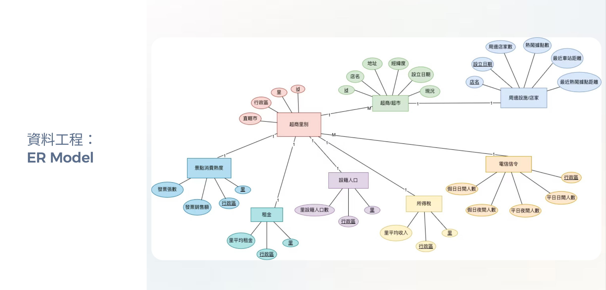
  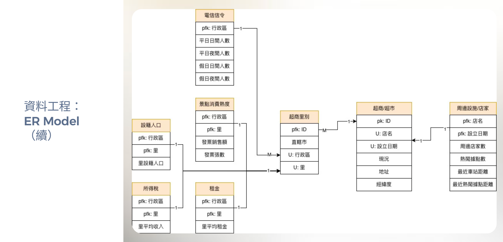

*資料庫實體關聯設計（ER Model）*

### ETL Pipeline：多源異質資料整合與資料品質處理

**三階段漸進式建表**（確保資料流清晰且易於維護）：

- **V1：** 整合地理行政區、電信人流、所得稅、人口、消費熱度，建立商圈基礎特徵。
- **V2：** 串接以店家為中心 500 公尺內的地理空間特徵，導入同異業競爭數量與時間遮罩動態競爭指標。
- **V3：** 導入實價登錄租金，並透過子查詢聚合排除一對多重複樣本，最終產出 **7,562 筆**乾淨訓練資料。

**多層次地理粒度配對：** 精準識別不同資料源的地理層級差異——電信信令落在行政區層級，所得稅與設籍人口落在更細的村里層級——動態調整 JOIN Keys（縣市 ＋ 行政區 ＋ 村里）確保關聯精準度。

**資料品質處理重點：**

- **地址解析失敗的修復策略：** 原始資料存在縣市、行政區解析失敗（顯示為「找不到」）的情況。未直接剔除樣本，改以 TGOS 與店家經緯度進行空間比對補值，最大化保留有效訓練樣本。
- **租金資料的膨脹風險防範：** 「雙北超商租金」來源存在重複里別記錄，若直接 JOIN 會造成樣本數發散。透過子查詢搭配 `GROUP BY` 與 `MAX(租金)` 預先聚合，取各里租金天花板後再 JOIN，確保樣本數維持 7,562 筆。

**六維特徵補值彙整：**

| 特徵類型 | 資料來源 | 補值內容 |
| --- | --- | --- |
| 地理行政區 | 地理資訊（經緯度比對） | 縣市、行政區、里別 |
| 動態人流 | 電信信令人口統計 | 平日／假日日間活動、夜間停留人數 |
| 消費基底 | 雙北設籍人口、所得稅 | 里人口數、人均收入中位數 |
| 消費熱度 | 觀光景點消費熱度分析 | 發票張數、銷售額指標 |
| 競爭特徵 | 超商超市競爭距離 | 500 公尺內同異業數量、熱鬧據點距離 |
| 展店成本 | 雙北超商租金 | 里別租金天花板 |

> 📄 完整多源異質資料整合 SQL 腳本（MySQL）：[`code/etl_integration.sql`](code/etl_integration.sql)

## 🔍 EDA 與商業洞察

**共線性與特徵排除：** 透過相關係數矩陣發現行政區日夜／平假日人流（四變數）以及發票張數與銷售額（兩變數）存在高度共線性，後續進行特徵調整以提升模型的泛化能力。

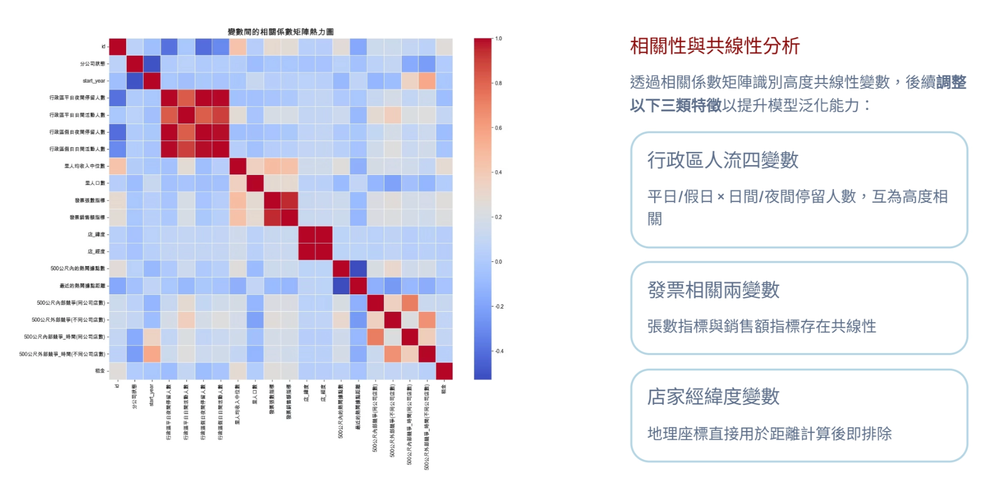
*特徵相關係數矩陣：辨識高度共線性群組*

**極端值處理：** 在數值分佈分析中，發現「租金」與「里人口數」呈現嚴重右偏分佈（租金最高達 101 萬），故導入對數轉換（Log Transform）消除極端值對模型的干擾。

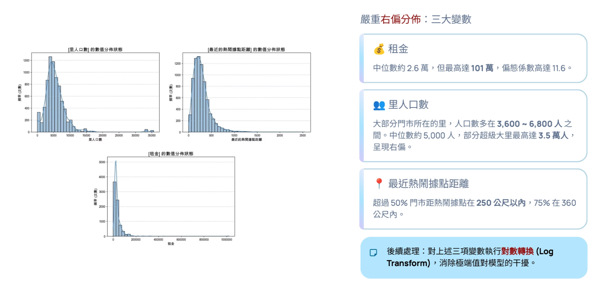
*右偏數值特徵的分佈與對數轉換*

**倖存者偏差：** 發現多數單一特徵與目標變數（營運／廢止）無明顯差異，洞察出這是因為「廢止」店鋪在初期選址時其實已符合開好店的基準（預先篩選偏差），進而確立後續需強化複合式特徵工程的方向。

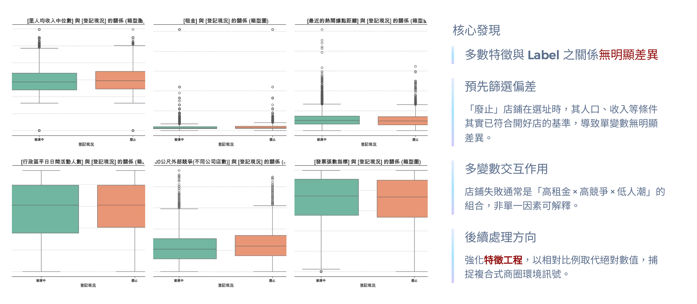
*單一特徵於營運／廢止標籤間差異不顯著（倖存者偏差）*

## 🧠 模型建構與評估

### 特徵工程與防呆機制

- **初步特徵排除：** 為避免模型死背地理位置與發生標籤滲漏，果斷剔除地址等高基數特徵以及開店時間、營運年份等時間特徵，引導模型依據靜態環境特徵進行預測。
- **二次特徵工程：** 將絕對數量轉化為相對比例，衍生「店均服務人數」、「競爭壓力指標」與「日夜人流差」等高價值特徵，真實反映單店能分到的潛在客群、區分住宅與商圈、品牌競爭度等。
- **防範資料洩漏：** 發現「500m 外部競爭_時間遮罩」特徵過強——旁邊有自家門市，代表總部覺得市場還有空間，等於利用內部資訊當免死金牌，導致特徵影響力過強、擠壓其他特徵，最終決定予以排除。

### 模型訓練與演算法選擇

- **模型訓練策略：** 突破業態孤島，採用「便利商店 ＋ 超市藥妝」混合業態共同訓練，強迫模型學習整體商圈的繁榮特徵，避免過度擬合。
- **演算法選擇：** 橫向對比 SVM、Random Forest 與 CatBoost 後，最終選定靈活性與精確度最高的 XGBoost，能妥善處理營運與廢止標籤重疊的邊界問題，並提供穩定的預測機率分佈。

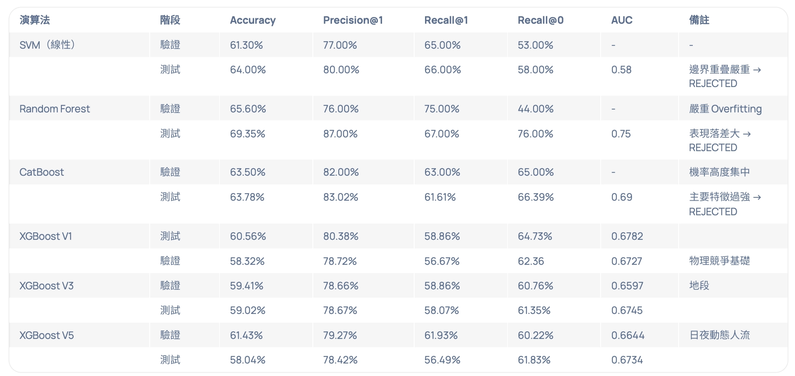
*SVM / Random Forest / CatBoost / XGBoost 橫向比較*

**超參數調整與商業邏輯**（調參目標並非單純追求最高分，而是賦予模型「商業思考」能力）：

- **防止特徵霸凌：** 透過特徵隨機採樣（`colsample_bytree = 0.8`），強迫模型在缺乏強勢品牌特徵時，也能扎實學習人口與人流邏輯。
- **提升模型抗噪力：** 設定較淺的樹深（`max_depth = 4`）與數據隨機性（`subsample = 0.8`），防止過度記憶雙北特定路段的極端雜訊，確保對未見區域的預測力。
- **決策趨向保守穩健：** 增強正則化懲罰（`gamma / lambda = 1 / 1`），讓模型僅在特徵組合具高度說服力時才進行預測，大幅提升精準率（Precision）。

### 雙軌推薦門檻策略

依不同商業模式的資本投入差異設定門檻：

- **便利商店**（市場飽和度高、進入門檻低，以追求市佔為主）：推薦門檻 50 分（機率 > 0.5）。50 分切線位於分佈交界帶，是平衡「市佔擴張」與「風險控管」的甜蜜點。
- **超市藥妝**（投資規模較大，對人流、消費力與競爭格局要求高，以追求零容錯為主）：推薦門檻 70 分（機率 > 0.7）。70 分切線已推進到安全區，數據化「零錯誤容忍」的嚴選邏輯。

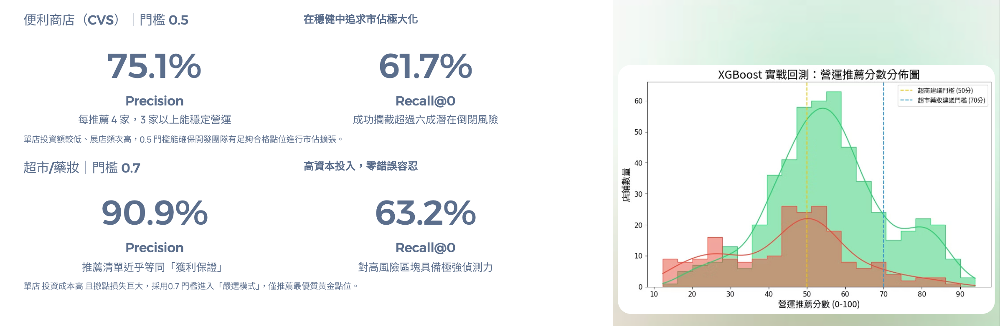
*雙軌推薦門檻下的 Precision／Recall 評估*

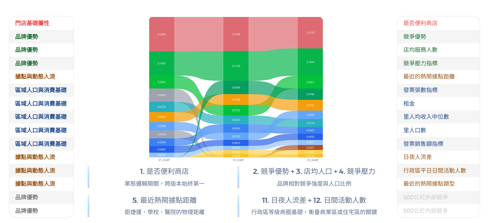
*營運／廢止標籤的預測機率分佈*

### 模型評估與成果展現

- **SHAP Value 解釋性：** 透過 SHAP Value 發現「是否便利商店」作為邏輯開關始終維持第一；模型成功弱化絕對數量，使「店均服務人數」等相對比例成為關鍵變數。
- **模型成果表現：** 最終模型能精準區分紅海市場的物理距離競爭硬指標，並透過動態人流理解行政區商圈特性，成功捕捉藍海市場的潛力。

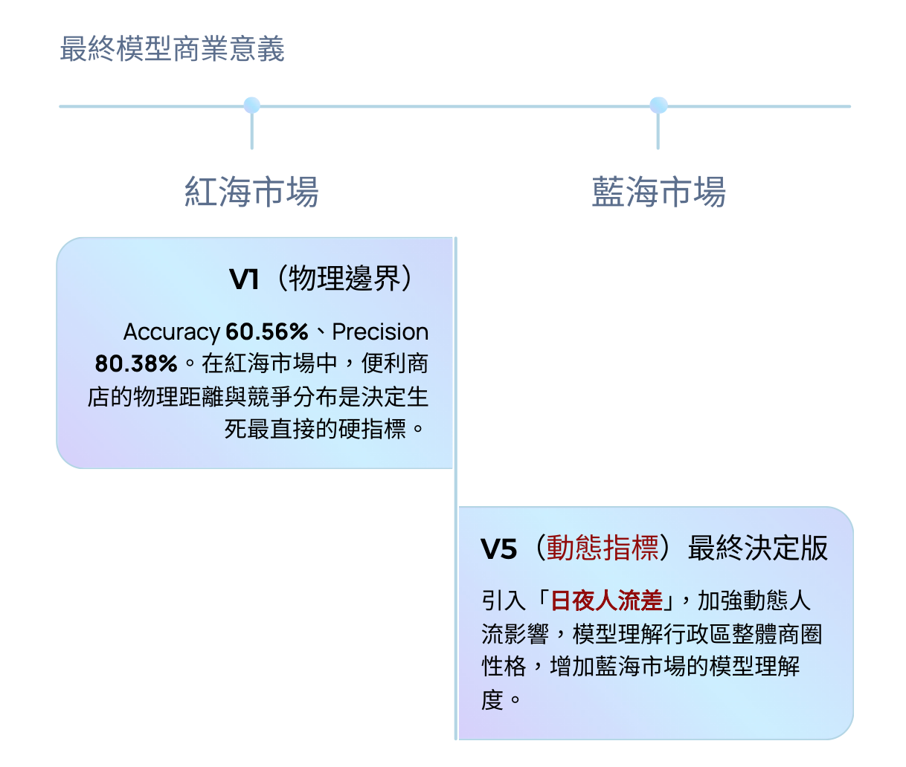
*最終模型商業意義：紅海市場（物理邊界）與藍海市場（動態指標）的區辨*

## 💻 系統說明與商業落地

**系統架構：** 採用 GCP 雲端環境（GCS 儲存模型），後端透過 FastAPI 結合 XGBoost 進行核心預測運算，並以 LangChain 串接 Gemini LLM，前端則透過 Angular 提供使用者多維度的地理與品牌篩選介面。

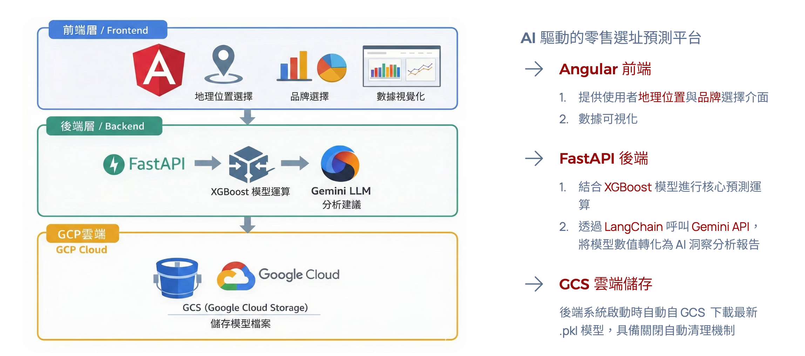
*系統架構：Angular（前端）＋ FastAPI ＋ XGBoost ＋ LangChain／Gemini LLM ＋ GCS*

**數據可視化與決策輔助：**

- **競爭態勢雷達圖：** 將複雜的 SHAP 特徵影響力轉換為 1–5 分的直觀評級，讓決策者一眼掌握該點位在人口、收入、租金與競爭對手等關鍵指標的均衡度強弱。
- **AI 洞察報告：** 利用提示詞工程，將 XGBoost 的預測數值與前兩大影響特徵拋轉給 Gemini LLM，自動生成 60 字以內的易懂經營建議，並能依營運分數差距自動調整顧問語氣強度（保守、正向、積極）。

  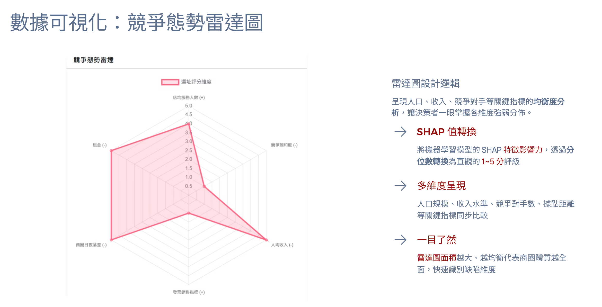
  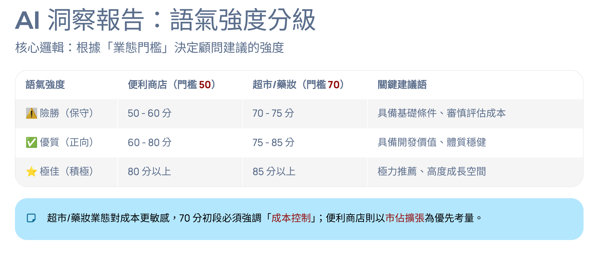

*左：競爭態勢雷達圖；右：AI 洞察報告的語氣強度分級邏輯*

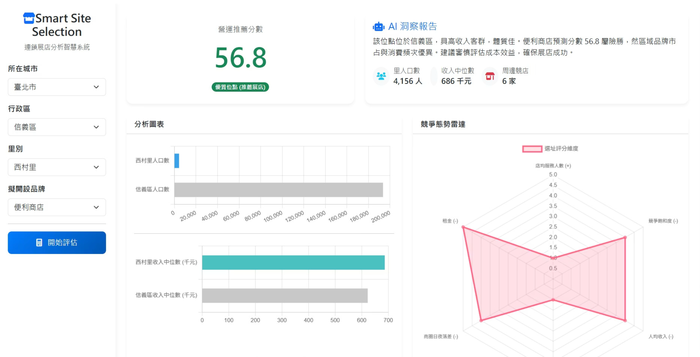
*Smart Site Selection 系統頁面概覽*

## 🔭 未來展望及總結

- **深化企業資料整合：** 收攏企業內部真實營收資料（如各店數據）進行模型再訓練，提升預測準確度至實戰等級。
- **坪效分析功能：** 結合企業內部租金成本與資產資訊，發展坪效分析模組，協助評估投資報酬率。
- **跨業態模型擴展：** 延伸至餐廳、民宿、飲料店、銀行、診所等多元場景，設計針對性預測模型。
- **地理維度由面到點：** 將分析精度從「里」為單位升級為以地址或經緯度為基準，實現點位級精準預測。

## 📚 Reference

- Erbıyık, H., Özcan, S., & Karaboğa, K. (2012). Retail store location selection problem with multiple analytical hierarchy process of decision making an application in Turkey. *Procedia-Social and Behavioral Sciences*, 58, 1405–1414.
- Roig-Tierno, N., Baviera-Puig, A., Buitrago-Vera, J., & Mas-Verdu, F. (2013). The retail site location decision process using GIS and the analytical hierarchy process. *Applied Geography*, 40, 191–198.
- Ou, T. Y., Fu, H. P., & Wu, M. Z. (2025). Optimize a chain convenience store location prediction model by using MTS-machine learning methodology. *Scientific Reports.*
